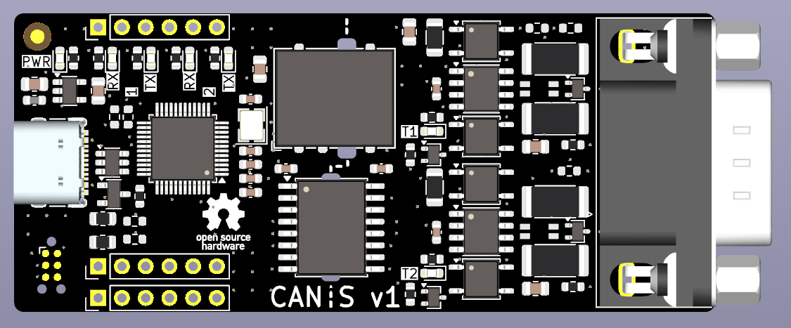

# canis-hw
Isolated USB CAN-FD interface with SW-controllable termination resistors



## Features
- 2xCAN-FD interfaces supporting 8Mb/s
- 3kV isolation
- SW-controllable CAN-termination resistors
- 24V tolerant CAN transceivers and CAN termination circuit
- USB Type-C connector
- 2-layer PCB design
- Easy to solder 0603 components

## Firmware
Please use this candleLight_fw [fork](https://github.com/bao-eng/candleLight_fw/tree/canis)(canis branch). \
Prebuilt binary ```canis_fw.bin``` can be found in [releases](https://github.com/bao-eng/candleLight_fw/releases).
#### Flashing via DFU
- Short J2 pins ```1``` and ```2```
- Connect USB to the host PC
- Unshort J2
- In the ```lsusb``` output you should be able to see ```STMicroelectronics STM Device in DFU Mode```
- Run ```sudo dfu-util -d 0483:df11 -c 1 -i 0 -a 0 -s 0x08000000 -D canis_fw.bin```
- Reconnect USB
- In the ```lsusb``` output you should be able to see ```OpenMoko, Inc. Geschwister Schneider CAN adapter```
#### Flashing via SWD
- Connect ST-link to the J2
- Connect USB to the host PC
- Run ```st-flash write canis_fw.bin 0x08000000```
- Disconnect ST-link from J2
- Reconnect USB
- In the ```lsusb``` output you should be able to see ```OpenMoko, Inc. Geschwister Schneider CAN adapter```
## Usage
Bring up can0 interface and enable 120Ohm termination resistor:
```
ip link set can0 up type can bitrate 1000000 dbitrate 8000000 fd on termination 120
```
Disable 120Ohm termination resistor:
```
ip link set can0 type can termination 0
```
